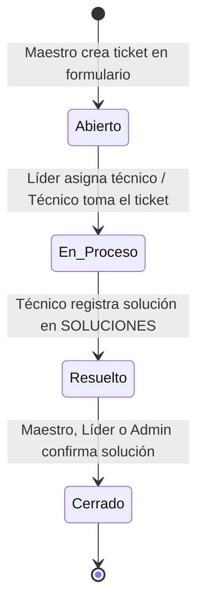

# Especificación de Lógica de Negocio y Reglas del Sistema (API II)
Este documento define las reglas de negocio, ciclo de vida de tickets, permisos por rol y automatizaciones para los desarrolladores del sistema.

## 1. Roles del Sistema y Modelo de Permisos
El sistema tiene 4 roles basados en la tabla `ROLES` y el campo `is_leader`:

1. **Superusuario / Administrador (`id_rol = 1`):**
   - Control global del sistema.
   - Alta, baja y edición de usuarios.
   - Asignación de técnicos y líderes a laboratorios.
   - Gestión del inventario de aulas y equipos.
   - Visualización y reasignación de cualquier ticket.

2. **Líder / Encargado de Laboratorio (`id_rol = 2` [Técnico] + `is_leader = TRUE`):**
   - Asignado a un laboratorio específico.
   - Puede haber **más de un líder por laboratorio**.
   - **Habilidades específicas:**
     - Ve la bandeja de tickets entrantes de su laboratorio asignado.
     - Puede asignarse tickets a sí mismo o delegarlos a cualquier técnico perteneciente a su mismo laboratorio.
     - No puede asignar tickets a técnicos de otros laboratorios ni ver bandejas de otros laboratorios.

3. **Técnico de Soporte (`id_rol = 2` [Técnico] + `is_leader = FALSE`):**
   - Asignado a un laboratorio específico.
   - Visualiza únicamente los tickets asignados a su persona.
   - Actualiza el estado de sus tickets (`En Proceso` $\rightarrow$ `Resuelto`).
   - Registra notas técnicas en la tabla de soluciones.

4. **Maestro / Usuario Final (`id_rol = 3`):**
   - Crea tickets seleccionando obligatoriamente el aula/laboratorio donde ocurrió la incidencia.
   - Visualiza únicamente el historial de tickets creados por él.
   - Puede confirmar la resolución para pasar el ticket a `Cerrado`.

## 2. Matriz de Permisos (CRUD)

| Acción | Maestro | Técnico | Líder Lab | Administrador |
|---|:---:|:---:|:---:|:---:|
| Crear Ticket | ✅ | ❌ | ❌ | ✅ |
| Ver Tickets de su Autoría | ✅ | ✅ | ✅ | ✅ |
| Ver Tickets Sin Asignar de su Lab | ❌ | ✅ | ✅ | ✅ |
| Asignar Técnico a Ticket de su Lab | ❌ | ❌ | ✅ | ✅ |
| Asignar Técnico a Cualquier Lab | ❌ | ❌ | ❌ | ✅ |
| Iniciar Atención (`En Proceso`) | ❌ | ✅ (Si está asignado) | ✅ (Si está asignado) | ✅ |
| Registrar Solución (`Resuelto`) | ❌ | ✅ (Si está asignado) | ✅ (Si está asignado) | ✅ |
| Cerrar Ticket (`Cerrado`) | ❌ | ❌ | ✅ (De su lab) | ✅ |
| Crear / Modificar Usuarios | ❌ | ❌ | ❌ | ✅ |
| Crear / Modificar Aulas y Equipos | ❌ | ❌ | ❌ | ✅ |

---

## 3. Ciclo de Vida del Ticket (Máquina de Estados)

### Transiciones y Reglas de Validación:

1. **`Abierto` (Estado Inicial):**
   - **Campos del formulario de reporte:**
     - `nombre_ticket` (VARCHAR 100): Asunto o título breve de la incidencia.
     - `id_aula` (INT NOT NULL): Aula o laboratorio donde se presenta el problema.
     - `id_equipo` (INT NULLABLE): Equipo específico afectado (opcional; `NULL` para fallas generales de aula, red o proyector).
     - `problemas_ids` (ARRAY[INT] NOT NULL): Lista de IDs seleccionados de `TIPOS_PROBLEMA` (al menos 1 categoría; permite asociar múltiples problemas al ticket en `TICKETS_PROBLEMAS`).
     - `descripcion` (TEXT NOT NULL): Redacción libre y detallada por el Maestro explicando la problemática.
   - **Consistencia:** Si se selecciona un equipo, el backend valida que `equipo.id_aula == ticket.id_aula`.
   - **Asignación Inicial:** Se guarda con `id_tecnico = NULL`. Cae automáticamente a la bandeja de entrada del laboratorio correspondiente.

2. **`En Proceso`:**
   - Ocurre cuando el Líder asigna a un técnico (`id_tecnico = <UUID>`).
   - El backend valida que el técnico asignado pertenezca a la misma aula (`tecnico.laboratorio_asignado_id == ticket.id_aula`).
   - **Reasignación:** Un Líder puede reasignar un ticket en proceso a otro técnico de su mismo laboratorio; el ticket continúa `En Proceso` y se audita el cambio en `HISTORIAL_ESTADO`.
   - **Automatización de Inventario:** Si el ticket tiene un `id_equipo` asociado, el backend actualiza automáticamente `EQUIPOS.estado_actual = 'En Mantenimiento'`.

3. **`Resuelto`:**
   - Solo el técnico asignado (o el administrador) puede marcar este estado.
   - **Requisito estricto:** El formulario exige enviar texto detallando qué se reparó. El backend inserta un registro en la tabla `SOLUCIONES`.
   - **Salida:**
     - **Confirmación (`Cerrado`):** El Maestro creador o el Administrador validan la solución satisfactoria y cierran el ticket con 1 clic de confirmación directa.
     - **Reapertura (`En Proceso`):** Si la falla persiste, el Maestro o el admin pueden reabrirlo, devolviendo el estado a `En Proceso` y el equipo a `'En Mantenimiento'`.

4. **`Cerrado`:**
   - Cierre definitivo mediante acción manual directa de 1 clic (sin encuesta obligatoria). Lo ejecuta el Maestro que creó el reporte tras validar que todo funciona, o el Líder/Administrador.
   - **Automatización de Inventario:** Si el ticket tiene un `id_equipo` asociado, el backend restaura `EQUIPOS.estado_actual = 'Operativo'`.
   - **Permanencia:** El ticket permanece en `Resuelto` hasta que exista una acción manual explícita de confirmación (no hay auto-cierre por temporizador).

---

## 4. Auditoría y Trazabilidad (`HISTORIAL_ESTADO`)

Cada vez que el endpoint de actualización de ticket detecte un cambio en la columna `estado`, FastAPI debe insertar una fila en `HISTORIAL_ESTADO`:
* `id_ticket`: ID del ticket modificado.
* `estado_anterior`: Valor previo.
* `estado_actual`: Nuevo valor.
* `id_usuario`: UUID del usuario autenticado que ejecutó la petición (obtenido del JWT).
* `fecha_cambio`: `NOW()`.

---

## 5. Sistema de Notificaciones

El sistema maneja un canal dual optimizado para evitar saturación de correos:

1. **Bandeja Interna (`NOTIFICACIONES`):**
   - Se inserta un registro en la base de datos para el usuario destino con `leido = FALSE`.
   - Se genera en todos los eventos (creación, asignación, solución, reapertura y cierre) para alimentar la campana de notificaciones de la SPA en tiempo real.
2. **Correo Electrónico Esencial (Supabase SMTP vía `fastapi.BackgroundTasks`):**
   - Despacho asíncrono en segundo plano para no bloquear respuestas HTTP.
   - **Eventos con envío de correo:**
     - **Al Técnico:** Cuando un Líder le asigna o reasigna un ticket (`En Proceso`).
     - **Al Maestro:** Cuando el técnico marca el ticket como `Resuelto` (incluye el texto de la solución registrada).
     - **Al Maestro:** Cuando el ticket pasa formalmente a `Cerrado`.
