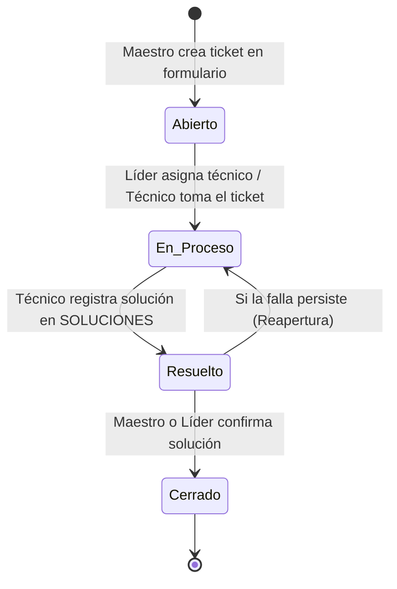

# Especificación de Lógica de Negocio y Reglas del Sistema (API II)
Este documento define las reglas de negocio, ciclo de vida de tickets, permisos por rol y automatizaciones para los desarrolladores del sistema.

## 1. Roles del Sistema y Modelo de Permisos
El sistema tiene 4 roles basados en la tabla `ROLES` y el campo `is_leader`:

1. **Superusuario / Administrador (`id_rol = 1`):**
   - Control global del sistema.
   - Alta, baja y edición de usuarios.
   - Asignación de técnicos y líderes a laboratorios.
   - Gestión del inventario de aulas y equipos.
   - Visualización y reasignación de cualquier ticket.

2. **Líder / Encargado de Laboratorio (`id_rol = 2` [Técnico] + `is_leader = TRUE`):**
   - Asignado a un laboratorio específico.
   - Puede haber **más de un líder por laboratorio**.
   - **Habilidades específicas:**
     - Ve la bandeja de tickets entrantes de su laboratorio asignado.
     - Puede asignarse tickets a sí mismo o delegarlos a cualquier técnico perteneciente a su mismo laboratorio.
     - No puede asignar tickets a técnicos de otros laboratorios ni ver bandejas de otros laboratorios.

3. **Técnico de Soporte (`id_rol = 2` [Técnico] + `is_leader = FALSE`):**
   - Asignado a un laboratorio específico.
   - Visualiza únicamente los tickets asignados a su persona.
   - Actualiza el estado de sus tickets (`En Proceso` $\rightarrow$ `Resuelto`).
   - Registra notas técnicas en la tabla de soluciones.

4. **Maestro / Usuario Final (`id_rol = 3`):**
   - Crea tickets seleccionando obligatoriamente el aula/laboratorio donde ocurrió la incidencia.
   - Visualiza únicamente el historial de tickets creados por él.
   - Puede confirmar la resolución para pasar el ticket a `Cerrado`.

## 2. Matriz de Permisos (CRUD)

| Acción | Maestro | Técnico | Líder Lab | Administrador |
|---|:---:|:---:|:---:|:---:|
| Crear Ticket | ✅ | ❌ | ❌ | ✅ |
| Ver Tickets de su Autoría | ✅ | ✅ | ✅ | ✅ |
| Ver Tickets Sin Asignar de su Lab | ❌ | ✅ | ✅ | ✅ |
| Asignar Técnico a Ticket de su Lab | ❌ | ❌ | ✅ | ✅ |
| Asignar Técnico a Cualquier Lab | ❌ | ❌ | ❌ | ✅ |
| Iniciar Atención (`En Proceso`) | ❌ | ✅ (Si está asignado) | ✅ (Si está asignado) | ✅ |
| Registrar Solución (`Resuelto`) | ❌ | ✅ (Si está asignado) | ✅ (Si está asignado) | ✅ |
| Cerrar Ticket (`Cerrado`) | ❌ | ❌ | ✅ (De su lab) | ✅ |
| Crear / Modificar Usuarios | ❌ | ❌ | ❌ | ✅ |
| Crear / Modificar Aulas y Equipos | ❌ | ❌ | ❌ | ✅ |

---

## 3. Ciclo de Vida del Ticket (Máquina de Estados)

### Transiciones y Reglas de Validación:

1. **`Abierto` (Estado Inicial):**
   - **Campos obligatorios:** `nombre_ticket`, `descripcion`, `id_aula`, `tipos_problema` (al menos 1).
   - **Equipo afectado (`id_equipo`):** Es **opcional**. Si se reporta una falla general (red del aula, clima, proyector general), se envía como `NULL`.
   - **Consistencia:** Si se selecciona un equipo, el backend valida que `equipo.id_aula == ticket.id_aula`.
   - **Asignación:** Se guarda con `id_tecnico = NULL`. Cae automáticamente a la bandeja del laboratorio.

2. **`En Proceso`:**
   - Ocurre cuando el Líder asigna a un técnico (`id_tecnico = <UUID>`).
   - El backend valida que el técnico asignado pertenezca a la misma aula (`tecnico.laboratorio_asignado_id == ticket.id_aula`).
   - **Automatización de Inventario:** Si el ticket tiene un `id_equipo` asociado, el backend actualiza automáticamente `EQUIPOS.estado_actual = 'En Mantenimiento'`.

3. **`Resuelto`:**
   - Solo el técnico asignado (o el administrador) puede marcar este estado.
   - **Requisito estricto:** El formulario exige enviar texto detallando qué se reparó. El backend inserta un registro en la tabla `SOLUCIONES`.

4. **`Cerrado`:**
   - Cierre definitivo. Lo ejecuta el Maestro que creó el reporte tras validar que todo funciona, o el Líder/Administrador.
   - **Automatización de Inventario:** Si el ticket tiene un `id_equipo` asociado, el backend restaura `EQUIPOS.estado_actual = 'Operativo'`.

---

## 4. Auditoría y Trazabilidad (`HISTORIAL_ESTADO`)

Cada vez que el endpoint de actualización de ticket detecte un cambio en la columna `estado`, FastAPI debe insertar una fila en `HISTORIAL_ESTADO`:
* `id_ticket`: ID del ticket modificado.
* `estado_anterior`: Valor previo.
* `estado_actual`: Nuevo valor.
* `id_usuario`: UUID del usuario autenticado que ejecutó la petición (obtenido del JWT).
* `fecha_cambio`: `NOW()`.

---

## 5. Sistema de Notificaciones

El sistema maneja un canal dual para notificaciones ante eventos clave (Creación de ticket, Asignación, Cambio a `Resuelto`, Cambio a `Cerrado`):

1. **Bandeja Interna (`NOTIFICACIONES`):**
   - Se inserta un registro en la base de datos para el usuario destino con `leido = FALSE`.
   - Alimenta la campana de notificaciones en el frontend en tiempo real.
2. **Correo Electrónico (Supabase SMTP):**
   - FastAPI invoca el envío de correo utilizando las credenciales SMTP de Supabase al correo registrado en `USUARIOS.email`.
   - El correo incluye enlace directo al ticket y resumen de la acción realizada.
